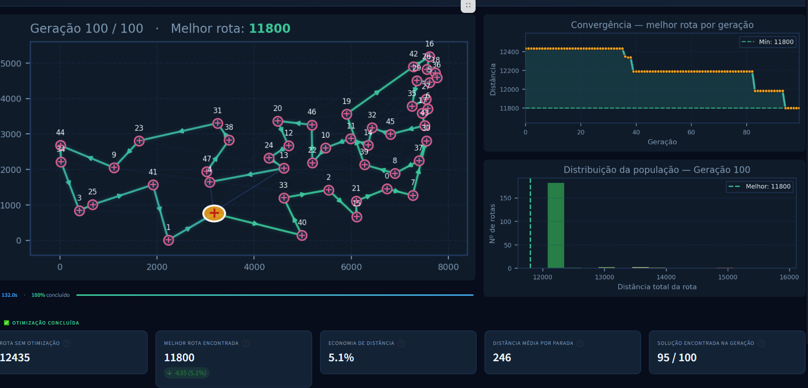

# 💊 MedRoute — Otimização de Rotas Hospitalares

Sistema de otimização de rotas para coleta e entrega de suprimentos médicos entre hospitais, utilizando Algoritmo Genético para resolver o Problema do Caixeiro Viajante (TSP) com análise inteligente via LLM.

---

## ✨ Features

| Feature | Descrição |
|---|---|
| 🧬 **Algoritmo Genético** | Evolução de população com seleção por torneio, crossover e mutação para encontrar a rota ótima entre hospitais |
| 🗺️ **Problema do Caixeiro Viajante** | Modelagem do TSP aplicado ao contexto hospitalar, minimizando a distância total percorrida entre unidades de saúde |
| 🤖 **Análise com LLM** | Interpretação dos resultados da otimização por modelo de linguagem, gerando insights sobre a rota encontrada e economia obtida |

---

## 📊 Resultados



| Métrica | Valor |
|---|---|
| Rota inicial | 12.435 km |
| Melhor rota encontrada | 11.800 km |
| Economia | 5,1% |
| Geração | 95 / 100 |
| Distância média da população | 246 km |
| Método de seleção | Tournament Selection |
| Tamanho da população | 200 indivíduos |
| Número de gerações | 100 |

---

## 🗂️ Estrutura de Arquivos

```
otimizacao-rotas-hospitalares/
│
├── app.py                  # Aplicação principal (Streamlit)
├── requirements.txt        # Dependências do projeto
│
├── ga/                     # Módulo do Algoritmo Genético
│   ├── algorithm.py        # Loop principal do GA
│   ├── cities.py           # Definição das cidades/hospitais
│   ├── crossover.py        # Operadores de crossover
│   ├── fitness.py          # Função de aptidão (distância total)
│   ├── mutation.py         # Operadores de mutação
│   ├── population.py       # Inicialização e gestão da população
│   └── selection.py        # Seleção por torneio (tournament selection)
│
├── src/
│   ├── config/             # Configurações do projeto
│   ├── ga/                 # Scripts de teste e configuração do GA
│   │   ├── main.py
│   │   ├── config.py
│   │   └── test.py
│   ├── llm/                # Integração com LLM
│   ├── modeling/           # Modelagem do problema
│   ├── notebooks/          # Jupyter Notebooks de experimentos
│   ├── experiments/        # Experimentos e variações de parâmetros
│   ├── results/            # Resultados salvos
│   └── visualization/      # Geração de gráficos e visualizações
│
└── docs/
    └── resultado.png       # Captura do resultado final da otimização
```

---

## ⚙️ Configuração do Ambiente

### Pré-requisitos

- Python 3.10+

### 1. Clone o repositório

```bash
git clone https://github.com/seu-usuario/otimizacao-rotas-hospitalares.git
cd otimizacao-rotas-hospitalares
```

### 2. Crie e ative o ambiente virtual

```bash
python -m venv venv

# Windows
venv\Scripts\activate

# Linux / macOS
source venv/bin/activate
```

### 3. Instale as dependências

```bash
pip install -r requirements.txt
```

---

## ▶️ Como Rodar

### Interface Web (Streamlit)

```bash
streamlit run app.py
```

Acesse `http://localhost:8501` no navegador.

### Execução direta do Algoritmo Genético

```bash
python ga/algorithm.py
```

---

## 🧬 Sobre o Algoritmo Genético

O GA é configurado com os seguintes parâmetros padrão:

| Parâmetro | Valor |
|---|---|
| Tamanho da população | 200 indivíduos |
| Número de gerações | 100 |
| Método de seleção | Tournament Selection |
| Representação | Permutação de hospitais |
| Função de fitness | Distância euclidiana total da rota |

A cada geração, os melhores indivíduos são selecionados via torneio, cruzados para gerar descendentes e submetidos a mutação, preservando a diversidade genética e convergindo para a rota de menor distância.

---

## 🤖 Análise com LLM

Após a execução do algoritmo, os resultados são enviados a um modelo de linguagem que interpreta:

- A qualidade da rota encontrada
- A economia percentual obtida em relação à rota inicial
- Sugestões de ajustes nos parâmetros do GA
- Análise do comportamento da população ao longo das gerações

---

## 📦 Dependências

```
streamlit
matplotlib
```

---

## 🎓 Contexto Acadêmico

Projeto desenvolvido como **Tech Challenge — Fase 2** do curso **IA para Devs** da **PosTech FIAP**, aplicando técnicas de otimização bio-inspirada e inteligência artificial generativa na resolução de problemas reais da área da saúde.
